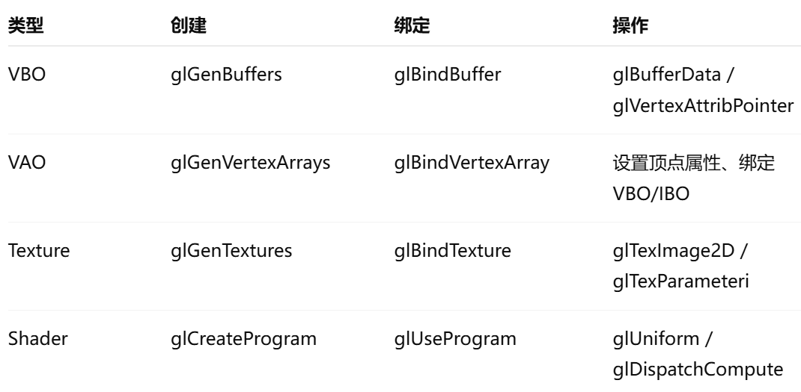
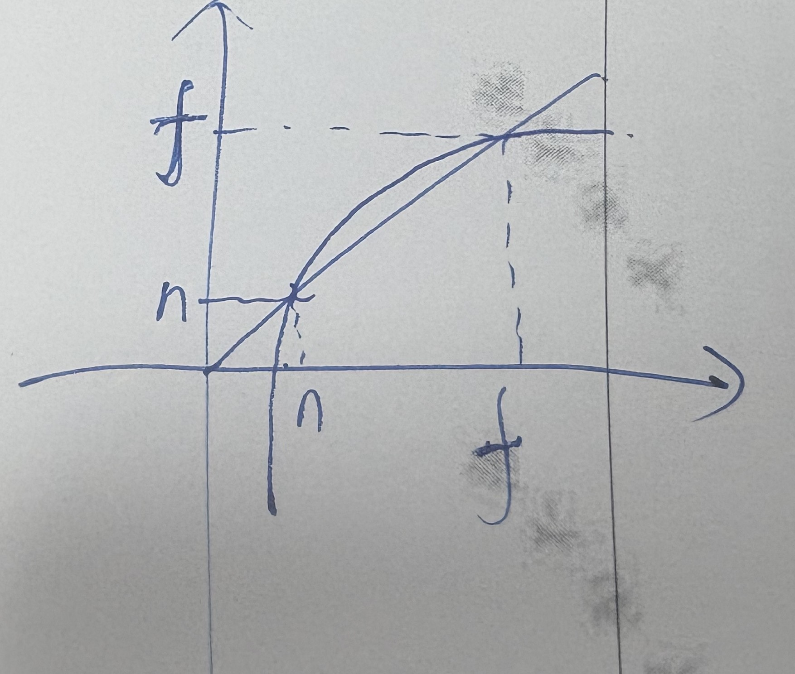
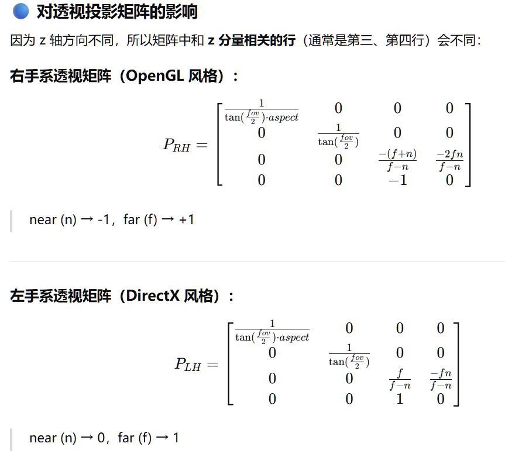

# 1. OpenGL中的绑定操作

在 OpenGL 里，`bind` 函数出现得非常频繁，这其实是 **OpenGL 的状态机设计思想** 的体现。理解它的意义就可以解释为什么几乎所有资源都要先绑定。

OpenGL 是 **状态机（state machine）**：

- GPU 内部维护一堆状态：当前绑定的纹理、缓冲对象、VAO、shader program 等等。

  当你调用 `glBind*` 时，实际上是告诉 GPU：

  “接下来对这个类型的操作，都作用在这个对象上。”

  也就是说 **绑定对象 = 激活对象**。

以纹理对象为例：

```c++
glGenTextures(1, &texture);        // 创建纹理对象
glBindTexture(GL_TEXTURE_2D, texture); // 绑定纹理
glTexImage2D(GL_TEXTURE_2D, 0, GL_RGBA, width, height, 0, GL_RGBA, GL_UNSIGNED_BYTE, data);
```

`glBindTexture(GL_TEXTURE_2D, texture)` 之后：

- 所有针对 `GL_TEXTURE_2D` 的操作（上传数据、设置参数）都 **作用在 `texture` 对象上**。

如果你不 bind，GPU 就 **不知道你要操作哪个纹理**。

OpenGL 中几乎所有对象（VBO、VAO、Framebuffer、Texture、Shader Program）都遵循这个规则：



# 2、GLSL中的矩阵

**GLSL中使用的矩阵是列主序，列主序在内存中是按列存储的，同时m\[i][j]的i是列索引，j是行索引；glm库也是列主序，m\[i][j]的i是行索引，j是列索引。因此可以直接把glm生成的正射投影矩阵和透视投影矩阵传递给GLSL的shader，不需要矩阵转置。**

经过MVP变换后，物体的坐标位于裁剪空间(clip space)，再经过透视除法后，物体的坐标变成裁剪坐标（坐标范围为[-1, 1]^3）。

之所以称为裁剪空间，是因为在这个阶段GPU会执行裁剪操作。裁剪（Clipping）是指 **移除那些位于视锥体（View Frustum）之外的顶点/三角形**，目的是：

- 避免渲染不可见的顶点或三角形
- 节省 GPU 的光栅化和片段处理开销

GPU 在 **裁剪阶段（Clipping Stage）** 对三角形进行判断：
$$
−w≤x,y,z≤w
$$
超出范围的顶点/三角形会被裁掉或截断

只保留视锥体内的三角形进行 **后续光栅化**。

## 裁剪和光栅化关系

1. **Vertex Shader** 输出**裁剪空间**顶点 `(x, y, z, w)`
2. **Clipping**：GPU 判断三角形是否在视锥内
   - 如果完全在外 → 丢弃
   - 如果部分在外 → 对三角形边进行裁剪，生成新的顶点
3. **Perspective Division / NDC**：对剩余顶点做透视除法 `(x/w, y/w, z/w)`
4. **Viewport Transform**：映射到屏幕空间

具体来说，从顶点着色器到片段着色器之间有一个光栅化步骤，该步骤执行如下操作：

**透视除法（Perspective Division）**

- 将裁剪空间坐标除以 `w` → 得到 NDC 坐标 `[-1,1]^3`

**视口变换（Viewport Transform）**

- 将 NDC 映射到屏幕像素坐标 `(screenX, screenY)`，且把深度坐标z映射到[0, 1]，近平面为-1->0，远平面为1->1。

**生成片段（Fragment Generation）**

- 对三角形覆盖的每个像素生成片段
- 对顶点着色器输出到片段着色器的变量（用out标识的变量）进行 **透视插值**
- 片段带有屏幕坐标、深度值、颜色/纹理坐标等信息

**裁剪 / 剔除**

- 屏幕外或不可见的片段丢弃
- 深度测试和模板测试在后续片段着色器中执行

在glsl中，`gl_Position`是顶点着色器中必须写入的**裁剪空间坐标**，`gl_FragCoord`是GPU管线在光栅化阶段生成并提供给片段着色器的内置只读变量，它的xy分量是经过透视除法和视口变换后的**屏幕坐标**，z分量是深度值，在OpenGL中范围为[0, 1]。视口大小是可以指定的，例如，在OpenGL中，可以通过`glViewport`定义视口的左下角坐标，以及宽度:

```C++
glViewport(0, 0, width, height);
```

视口的像素中心坐标范围如下：

$x\in[0.5,viewport\_width−0.5], y \in [0.5, viewport\_height - 0.5]$。

# 3、正射投影矩阵

首先明确，**无论左手坐标系还是右手坐标系，X轴正方向都是屏幕右方向，Y轴正方向都是屏幕上方向**。不管OpenGl还是D3D/Vulkan，我们要求用户传入近远平面距离相机的距离n和f必须为正数，因为它们表示距离，但在坐标系内部，实际上左手坐标系的近远平面均为正数，右手坐标系的近远平面均为负数。因此，投影矩阵的手性区分可以理解为API规定传入的n和f必须为正数，导致在右手坐标系下实际近远平面位置和用户传入参数不同！

对于D3D/Vulkan（左手坐标系），它的正射投影矩阵如下（代入n和f验证）：
$$
\begin{matrix}
\frac{2}{r-l}&0&0&-\frac{r+l}{r-l}\\
0&\frac{2}{t-b}&0&-\frac{t+b}{t-b}\\
0&0&\frac{1}{f-n}&-\frac{n}{f-n}\\
0&0&0&1
\end{matrix}
$$
对于OpenGL（右手坐标系），它的正射投影矩阵如下（代入-n和-f验证）：
$$
\begin{matrix}
\frac{2}{r-l}&0&0&-\frac{r+l}{r-l}\\
0&\frac{2}{t-b}&0&-\frac{t+b}{t-b}\\
0&0&-\frac{2}{f-n}&-\frac{f+n}{f-n}\\
0&0&0&1
\end{matrix}
$$
**它们的第三行的区别是由于D3D/Vulkan的z映射到[0, 1]而OpenGL映射到[-1, 1]。**

glm中之所以有四种正射投影矩阵，是因为glm规定传入API的n和f必须为正数，因此是它的实现导致与以上公式不符，**投影矩阵的表示实际上是手性无关的。**在glm中，按手性（左手：D3D/Vulkan/Metal，右手：OpenGL）和深度值映射到[0, 1]还是[-1, 1]，可以有四种矩阵，左手[-1, 1]坐标系的构造如下：

```C++
	template<typename T>
	GLM_FUNC_QUALIFIER mat<4, 4, T, defaultp> orthoLH_NO(T left, T right, T bottom, T top, T zNear, T zFar)
	{
		mat<4, 4, T, defaultp> Result(1);
		Result[0][0] = static_cast<T>(2) / (right - left);
		Result[1][1] = static_cast<T>(2) / (top - bottom);
		Result[2][2] = static_cast<T>(2) / (zFar - zNear);
		Result[3][0] = - (right + left) / (right - left);
		Result[3][1] = - (top + bottom) / (top - bottom);
		Result[3][2] = - (zFar + zNear) / (zFar - zNear);
		return Result;
	}
```

即：
$$
\begin{matrix}
\frac{2}{r-l}&0&0&-\frac{r+l}{r-l}\\
0&\frac{2}{t-b}&0&-\frac{t+b}{t-b}\\
0&0&\frac{2}{f-n}&-\frac{f+n}{f-n}\\
0&0&0&1
\end{matrix}
$$
但是看右手[-1, 1]正射投影矩阵如下：

```C++
	template<typename T>
	GLM_FUNC_QUALIFIER mat<4, 4, T, defaultp> orthoRH_NO(T left, T right, T bottom, T top, T zNear, T zFar)
	{
		mat<4, 4, T, defaultp> Result(1);
		Result[0][0] = static_cast<T>(2) / (right - left);
		Result[1][1] = static_cast<T>(2) / (top - bottom);
		Result[2][2] = - static_cast<T>(2) / (zFar - zNear);
		Result[3][0] = - (right + left) / (right - left);
		Result[3][1] = - (top + bottom) / (top - bottom);
		Result[3][2] = - (zFar + zNear) / (zFar - zNear);
		return Result;
	}
```

即：
$$
\begin{matrix}
\frac{2}{r-l}&0&0&-\frac{r+l}{r-l}\\
0&\frac{2}{t-b}&0&-\frac{t+b}{t-b}\\
0&0&-\frac{2}{f-n}&-\frac{f+n}{f-n}\\
0&0&0&1
\end{matrix}
$$
如果直接代入zNear和zFar我们无法得到-1和1。我们需要代入-zNear和-zFar，这是因为**glm的正交和透视矩阵API要求传入的n和f为正值！但事实上在右手坐标系下这两个值是负的。**再次注意，这里的公式不同只是glm实现上认定n和f必须为正值导致的！

> 指定透视投影矩阵我们只需要直接指定6个参数：上下左右近远平面的位置。且注意，这里的平面位置都是相机空间！

# 4、透视投影矩阵

正射投影矩阵没有近大远小的效果，我们需要一个能够变换后产生透视效果的矩阵，这就是透视压缩矩阵，这个矩阵需要满足如下特性：

- 和原坐标相乘后，x和y坐标除以z，这样的矩阵有很多，因此需要第二个条件约束
- 近平面的点坐标不变，近平面和远平面上的点的z坐标不变（线性变形）

同样地，我们规定n和f必须大于0，对于D3D/Vulkan，**透视压缩矩阵**如下：
$$
\begin{matrix}
1&0&0&0\\
0&1&0&0\\
0&0&\frac{n+f}{n}&-f\\
0&0&\frac{1}{n}&0
\end{matrix}
$$
对于OpenGL，透视压缩矩阵如下：
$$
\begin{matrix}
1&0&0&0\\
0&1&0&0\\
0&0&\frac{n+f}{n}&f\\
0&0&-\frac{1}{n}&0
\end{matrix}
$$
有的资料给出的透视矩阵每个元素都乘上了n，这是由于齐次坐标的特性，可以对该矩阵乘上一个常数，保持意义不变。

以D3D/Vulkan为例，我们可以看到(x, y, z, 1)经过透视压缩矩阵变换后变为$(x, y, z\frac{n+f}{n}-f, \frac{z}{n})$，即$(\frac{nx}{z}, \frac{ny}{z}, n+f-\frac{nf}{z}, 1)$，则透视压缩矩阵对z轴的压缩曲线如下：



透视压缩矩阵的效果是**几乎所有点被压缩的更靠近远平面了**（除近、远平面上的点外）。**透视压缩仅和n、f相关，即只和物体举例我们的远近相关！**

做完透视压缩，我们还要进行一次正射投影才能把所有的点变换到裁剪空间，因此最终的透视投影矩阵为
$$
M_{perspective}=M_{Orthographic}*M_{Press}
$$
因此对于OpenGL，它的透视投影矩阵为：
$$
\begin{matrix}
\frac{2n}{r-l}&0&0&0\\
0&\frac{2n}{t-b}&0&0\\
0&0&-\frac{f+n}{f-n}&-\frac{2fn}{f-n}\\
0&0&-1&0
\end{matrix}
$$
对于D3D/Vulkan，它的透视投影矩阵为（这里的fov均为fovy，即y轴方向的field of  view）：



Tips：

- 以OpenGL的透视矩阵为例，我们只看z坐标，代入`(x, y, -n, 1)`和`(x, y, -f, 1)`（均在相机空间下）我们能够得到变换后的坐标分别为`(*, *, -n, n)`和`(*, *, f, f)`也就是把z坐标变换到了`(-1, 1)`范围内。我们也可以利用该性质测试我们编写的摄像机类是否存在错误。
- 注意到无论是左手坐标系还是右手坐标系，它们的左上角都除了一个aspect，用于对x轴坐标进行缩放，举个例子，假设我们想要将一个正方形面绘制到屏幕上仍然是正方形，它的左下角坐标为(-1, -1)，右上角坐标为(1, 1)。屏幕宽高比为2:1，假设我们将aspect错误地设置为1，x轴宽度和y轴宽度被等比例保留到标准设备空间，再经过视口变换变换为屏幕坐标，x轴[-1, 1]映射到[0, width]，x增加1所占的像素是y的两倍！我们事先除了aspect就可以把x轴压缩，在转换为屏幕坐标时就能保持等长。利用这个性质我们可以通过绘制正方体测试我们编写的相机类是否是否正确。

指定透视投影矩阵无法像正射投影那样指定六个平面位置，因为尽管透视压缩会对z轴进行线性压缩，但是x轴和y轴被压缩成什么样了我们不知道。通常我们通过如下几个参数指定透视投影矩阵：

- fovy（垂直方向fov，弧度值，有$tan(fovy/2)=\frac{t-b}{2n}$），aspect_ratio（宽高比，即$\frac{r-l}{t-b}$）,n(近平面)，f(远平面)

**注意，同样有左手系和右手系之分，由于要求n和f均大于0，只需要在对应的矩阵元素前取负即可。**根据深度值取[-1, 1]还是[0,1]以及左右手系不同，glm同样给出了四种不同的实现，可以根据需求使用。一般教程给出的是左手系的深度值映射到[-1, 1]

# 5、窗口DPI

1️⃣ 程序里指定的尺寸通常是 **逻辑像素**

在大多数跨平台窗口和 GUI 编程环境（GLFW、SDL、Qt、Win32 API 等）中：程序里指定的尺寸通常是 **逻辑像素**。

例如我们使用glfw创建窗口

```C++
glfwCreateWindow(w, h, "My Window", nullptr, nullptr);
```

`w` 和 `h` 是 **逻辑像素（Logical Pixels）**，也就是 UI 系统看到的尺寸，不直接等于物理像素。

逻辑像素 = 用户希望看到的“窗口大小”，独立于显示器 DPI。

2️⃣ 物理像素 vs 逻辑像素

| 类型     | 含义               | Windows 200%缩放  |
| -------- | ------------------ | ----------------- |
| 逻辑像素 | 程序指定的窗口大小 | w\*h=800\*600     |
| 物理像素 | 实际显示器上的像素 | 2w\*2h=1600\*1200 |

3️⃣ 帧缓冲大小（OpenGL 渲染时用的）

OpenGL 需要知道 **实际像素数量** 来正确设置视口：

```C++
int fb_w, fb_h;
glfwGetFramebufferSize(window, &fb_w, &fb_h);  // 返回物理像素
glViewport(0, 0, fb_w, fb_h);
```

**`glViewport` 的原理**

它把 **标准化设备坐标（Normalized Device Coordinates, NDC）** 转换成 **窗口坐标（Window Coordinates）**。

在 OpenGL 渲染管线中，顶点经过：

1. 模型变换（Model）
2. 视图变换（View）
3. 投影变换（Projection）

得到 **裁剪空间坐标** → 除以 w 得到 **标准化设备坐标 (x_ndc, y_ndc, z_ndc)**

- NDC 范围固定在[−1,1]

接下来需要把 NDC 映射到**实际屏幕窗口像素坐标**，这一步就是 `glViewport` 做的。假设调用：

```C++
glViewport(x, y, width, height);
```

- `(x, y)` → 左下角窗口坐标（窗口左下角相对于屏幕的偏移）

- `width, height` → 窗口尺寸

那么 NDC → Window 坐标的映射为：
$$
x_w=x+\frac{width}{2}*(x_{nd}+1)\\
y_w=y+\frac{height}{2}*(y_{nd}+1)
$$
注意 **左下角是原点**（OpenGL 默认窗口坐标系）。

**为什么我们需要这个函数？**

**窗口可调大小**时，OpenGL 默认不会自动调整视口。

如果不更新 `glViewport`，渲染出来的图形会 **拉伸或压缩**。要看到拉伸或压缩的效果需要我们自定义FBO，在不自定义FBO时，OpenGL绘制在默认帧缓冲内（调用glfwCreateWindow时创建），对于默认帧缓冲，有些平台/驱动会自动 **将渲染内容按窗口大小适配**，所以即便你不调用 `glViewport`，渲染内容看起来也不会拉伸。

**物理PPI/DPI**

PPI（Pixels per inch）通常使用于计算机屏幕，DPI (Dots per inch)通常使用于打印机；但是这两者之间通常被混用，需要在具体的上下文去理解其含义。

以一块4K 27英寸显示器为例，27英寸是对角线，它的宽约为23.5英寸，高为13.2英寸，物理尺寸和像素宽高比都是16:9，每个像素基本为正方形。
$$
PPI=\frac{水平像素数}{屏幕宽度（英寸）}=\frac{垂直像素数}{屏幕高度（英寸）}
$$
因此这块显示器的PPI为$\frac{3840}{23.5} \approx 163$。

## 4️⃣ 总结

- **窗口大小、UI 元素尺寸** → 逻辑像素（程序指定）
- **帧缓冲大小、OpenGL 渲染尺寸** → 物理像素（可能大于逻辑像素，受 DPI 缩放影响）
- **DPI 缩放** 是逻辑像素到物理像素的桥梁，程序通常不直接处理物理像素，除非涉及精确渲染。

# 6、OpenGL DSA接口

从4.5版本开始，OpenGL引入了一系列DSA接口，让我们在操作OpenGL中的一系列object时不需要先选中再操作，在我们知道对象的id的情况下可以直接一行代码搞定。

以创建纹理为例，在4.5之前，我们使用如下的代码创建纹理：

```C++
    glGenTextures(1, &m_renderer_id);
    glBindTexture(GL_TEXTURE_2D, m_renderer_id);

    glTexParameteri(GL_TEXTURE_2D, GL_TEXTURE_MIN_FILTER, GL_LINEAR);
    glTexParameteri(GL_TEXTURE_2D, GL_TEXTURE_MAG_FILTER, GL_LINEAR);
    glTexParameteri(GL_TEXTURE_2D, GL_TEXTURE_WRAP_S, GL_MIRRORED_REPEAT);
    glTexParameteri(GL_TEXTURE_2D, GL_TEXTURE_WRAP_T, GL_CLAMP_TO_EDGE);

    glTexImage2D(GL_TEXTURE_2D, 0, GL_RGBA8, m_width, m_height, 0, GL_RGBA, GL_UNSIGNED_BYTE, m_local_buffer);
```

在4.5+，代码如下：

```C++
// 必须调用这个，不能使用glGenTextures，否则glBindTextureUnit会报错，glGenTextures只是分配id，这个函数会创建texture2d对象 
	glCreateTextures(GL_TEXTURE_2D, 1, &m_renderer_id); 
    glBindTextureUnit(slot, m_renderer_id);

    glTextureParameteri(m_renderer_id, GL_TEXTURE_MIN_FILTER, GL_LINEAR);
    glTextureParameteri(m_renderer_id, GL_TEXTURE_MAG_FILTER, GL_LINEAR);
    glTextureParameteri(m_renderer_id, GL_TEXTURE_WRAP_S, GL_CLAMP_TO_EDGE);
    glTextureParameteri(m_renderer_id, GL_TEXTURE_WRAP_T, GL_CLAMP_TO_EDGE);

    glTextureStorage2D(m_renderer_id, 1, GL_RGBA8, m_width, m_height); // 分配存储（现代 DSA，替代 glTexImage2D）
    glTextureSubImage2D(m_renderer_id, 0, 0, 0, m_width, m_height, GL_RGBA, GL_UNSIGNED_BYTE,
                        m_local_buffer); // 上传像素数据
```

有三个原因让我们使用DSA接口

1. **不容易出错**

   相比于传统的状态机接口， `glTexParameteri` 操作的对象完全取决于当前绑定的 `GL_TEXTURE_2D`，这带来几个问题：

   - 需要不断 bind / unbind，容易出错。
   - 调用顺序对正确性影响很大。

   DSA接口`glTextureParameteri`则直接指定对象，不需要再考虑 “现在谁绑在 GL_TEXTURE_2D 上”，逻辑更清晰。

2. ### 减少状态切换（性能更好）

   绑定操作本身是有开销的（驱动层需要修改上下文状态）。
    在复杂场景下，频繁的 `glBindTexture`、`glBindBuffer`、`glBindFramebuffer` 都会拖慢性能。
    DSA 避免了这种多余的绑定。

3. 更符合现代 API 设计

   现代图形 API（如 Vulkan、D3D12、Metal）都放弃了全局状态机，采用“直接操作资源”的模型。DSA 让 OpenGL 的代码风格更接近这些 API，学习和迁移更容易。

但是需要注意，OpenGL 的核心仍然是 **全局状态机**（context + state machine）-所有渲染、资源操作最终都会修改 context 中的某些状态，GPU 执行时依赖这些状态，这一点在 DSA 出现后也没有变。

#### 传统接口 vs DSA 的区别

- **传统接口**（pre-4.5）：
   需要先 `glBindXxx(target, id)`，再调用 `glXxxParameteri(target, ...)`。
   驱动内部会查“当前 target 绑定的对象”，然后修改它。
- **DSA 接口**（4.5+）：
   直接传入对象 ID，例如 `glTextureParameteri(tex, pname, param)`。
   驱动内部会根据传入的 ID 定位到对象，然后修改它。

👉 **区别仅在于：驱动查找对象的方式不同**

- 传统接口：从绑定点查找。
- DSA 接口：直接用对象 ID。

最终效果：都是修改了 GPU 上的对象数据，渲染流水线和运行模式没有本质变化。

#### 为什么要引入 DSA

引入 DSA 并不是因为 GPU 的工作模式变了，而是为了：

- **减少冗余的状态绑定**（性能 + 清晰度）
- **降低开发者心智负担**（不用再担心当前绑定的是哪个对象）
- **与现代 API 接轨**（Vulkan、D3D12 没有全局状态机，都是显式对象操作）

#### 驱动层实现

很多驱动在实现 DSA 时，**内部依然会走绑定路径**：

- 例如 `glTextureParameteri(tex, ...)` 可能会在驱动里临时绑定 `tex`，调用旧的逻辑，再解绑。
- 只是在 API 层隐藏了这些细节，对开发者透明。
- 所以它并不是 GPU 硬件层面上的“革命性变化”，而是 API 的改进。

# 7、OpenGL 4.5+和以前的关键区别

## 7.1shader program创建

- **传统 OpenGL pipeline 问题**

  早期 OpenGL：每个 program object 包含完整的 shader 阶段（vertex + fragment + optional geometry/tessellation）。如果你只想替换片元着色器，就必须重新创建一个新的 program object，导致难以复用 shader，shader 管理灵活性低。

- **Separable Program + Program Pipeline**

  OpenGL 4.1/4.5 引入 **separable program** 和 **program pipeline**。

  特点：

  - 每个 shader 阶段可以单独编译为 **独立 program**。
  - 用 program pipeline 将它们组合成一个完整的渲染 pipeline。
  - 可以在运行时灵活替换单个 shader 阶段，而无需重建整个 program。

## 7.2 vertex array、vertex buffer和index buffer的创建和绑定

假设顶点结构：**位置 (vec3) + 颜色 (vec3)**，存在同一个 VBO 里。

```C++
struct Vertex {
    float pos[3];
    float color[3];
};
```

新版本代码如下：

```C++
GLuint vao, vbo;
glCreateVertexArrays(1, &vao);
glCreateBuffers(1, &vbo);
glNamedBufferData(vbo, sizeof(vertices), vertices, GL_STATIC_DRAW);

// 把 vbo 绑定到 VAO 的 binding point 0
glVertexArrayVertexBuffer(vao, 0, vbo, 0, sizeof(Vertex));

// attribute 0 → position (vec3)
glEnableVertexArrayAttrib(vao, 0);
glVertexArrayAttribFormat(vao, 0, 3, GL_FLOAT, GL_FALSE, offsetof(Vertex, pos));
glVertexArrayAttribBinding(vao, 0, 0);  // 指定attribute 0的binding point为0

// attribute 1 → color (vec3)
glEnableVertexArrayAttrib(vao, 1);
glVertexArrayAttribFormat(vao, 1, 3, GL_FLOAT, GL_FALSE, offsetof(Vertex, color)); // 说明属性格式
glVertexArrayAttribBinding(vao, 1, 0);  // 指定attribute 1的binding point为0
```

这里：

- `bindingindex = 0` → 意味着两个 attribute（位置和颜色）都从 **binding point 0**（也就是 `vbo`）里取数据。

如果以后想把颜色单独放在另一个 VBO，只需要：

```C++
glVertexArrayVertexBuffer(vao, 1, colorVbo, 0, sizeof(Color));
glVertexArrayAttribBinding(vao, 1, 1);  // attribute 1 改用 binding point 1
```

因此我们可以把 **Binding Point** 看作一个 **桥梁 (bridge / slot)**：

- **VBO → Binding Point**：用

  ```C++
  glVertexArrayVertexBuffer(vao, bindingIndex, vbo, offset, stride);
  ```

  把一个 VBO 绑定到某个 binding point。

- **Attribute → Binding Point**：用

  ```C++
  glVertexArrayAttribBinding(vao, attribIndex, bindingIndex);
  ```

  多个 Attribute 可以绑定到一个 Binding Point，例如：位置 + 颜色 + 法线都存储在一个 VBO 里（交错格式 Interleaved）。

  ```C++
  glVertexArrayVertexBuffer(vao, 0, vbo, 0, sizeof(Vertex));
  
  glVertexArrayAttribBinding(vao, 0, 0); // pos -> binding 0
  glVertexArrayAttribBinding(vao, 1, 0); // color -> binding 0
  glVertexArrayAttribBinding(vao, 2, 0); // normal -> binding 0
  ```


# 8、动态上传顶点数据

 在实际开发中我们经常需要修改顶点缓冲区的数据，而不是在程序一开始时就创建数据并上传至GPU，在OpenGL中有几种方法实现动态修改缓冲区中的数据。

首先我们需要改变的是创建顶点缓冲区的写法，我们将数据指针设置为`nullptr`表明我们只想分配空间，无需上传数据，将`usage`声明为`  GL_DYNAMIC_DRAW`表明我们后面会经常修改：

```C++
    // 创建缓冲区并将数据上传到GPU
    glCreateBuffers(1, &m_renderer_id);
    glNamedBufferData(m_renderer_id, size, nullptr, GL_DYNAMIC_DRAW);
```

然后进入上传步骤，有多种方式把内存中的数据上传至GPU，列举如下。

## 8.1 使用glMapBuffer(2.0+)/glMapNamedBuffer(4.5+)

`glMapBuffer/glMapNamedBuffer`将指定的`VertexBuffer`的所有GPU空间映射到内存中，

```C++
VertexBuffer::VertexBuffer(const void *data, unsigned int size, GLenum usage)
{
    // 创建缓冲区并将数据上传到GPU
    glCreateBuffers(1, &m_renderer_id);
    glNamedBufferData(m_renderer_id, size, data, usage);
    // GL_DYNAMIC_STORAGE_BIT保证缓冲可写（通过glBufferSubData等），GL_MAP_WRITE_BIT保证缓冲可映射且映射后可写
    glNamedBufferStorage(m_renderer_id, size, data, GL_DYNAMIC_STORAGE_BIT | GL_MAP_WRITE_BIT);
}

void VertexBuffer::SubData(const void * data, size_t size)
{
    // 一般我们需要MAP后可以写就行
    void *ptr = glMapNamedBuffer(m_renderer_id, GL_WRITE_ONLY);
    if (ptr)
    {
        memcpy(ptr, data, size);
        // 传输完必须调用unmap
        glUnmapNamedBuffer(m_renderer_id);
    }
    else
    {
        std::cerr << "Failed to map buffer!" << std::endl;
    }
}
```

关于map系列函数的用法有几点注意事项：

- 该函数返回的指针不能用于其他GL命令中
- 当我们对返回指针所做的操作与access中表示的使用方式不符时（比如access使用GL_WRITE_ONLY，但是我们在使用的时候去读取该指针所表示的数据（也就是我们使用了类似于GL_READ_ONLY的用法），会导致未定义的结果，应用程序可能会因此崩溃）
- 尽量保证使用access的方式与我们创建缓冲区对象所使用的标示一致，比如我们创建缓冲区对象的时候使用了GL_STATIC_READ，那么我们在使用access的时候使用GL_READ_ONLY，否则存取速度可能会慢几个数量级。

## 8.2 使用glBufferSubData


glBufferStorage, glNamedBufferStorage, glBufferData, 和 glNamedBufferData 都是OpenGL中用于管理缓冲对象（例如顶点缓冲、索引缓冲或通用目的缓冲）的函数，但它们在功能和行为上有一定的区别：

glBufferData 和 glNamedBufferData

glBufferData 函数分配一个新的可变大小的数据存储区域给当前绑定到指定目标的缓冲对象，并且可以将客户端内存中的数据复制到该缓冲区。这个函数创建的数据存储是可变的，意味着应用程序可以在任何时候重新定义或更新其内容。
glNamedBufferData 直接作用于通过名称指定的缓冲对象，而不是依赖于当前绑定的对象。其功能与 glBufferData 类似，也是分配可变大小的存储空间并可选择性地填充数据。

glBufferStorage 和 glNamedBufferStorage

glBufferStorage 是一个更高级的函数，它分配的是不可变（immutable）或者持久化（persistent）的数据存储空间。一旦使用此函数创建了缓冲区，就不能改变其大小，而且根据所传入标志的不同，可能无法重写整个数据存储的内容。这对于GPU能够进行优化，比如预读取和缓存数据，提供了更强的保证。
glNamedBufferStorage 同样直接作用于指定名称的缓冲对象，提供与 glBufferStorage 相同的功能，即分配不可变或持久化的存储空间。

具体来说：

- 可变性（Mutability）：glBufferData 系列函数允许创建可变存储，而 glBufferStorage 系列函数则默认创建不可变存储，除非指定了特定的标志允许部分修改。
- 映射模式（Mapping Modes）：glBufferStorage 可以设置额外的标志来控制如何映射缓冲区到客户端内存，如是否支持读写映射等。
- 性能提示（Usage Hints）：虽然 glBufferData 接受一个 usage 参数作为性能提示，但 glBufferStorage 并没有这样的参数，因为它通常暗示着对缓冲内容的长期持久利用。

总之，glBufferData / glNamedBufferData 更适合需要频繁修改或一次性上传数据的应用场景；而 glBufferStorage / glNamedBufferStorage 则更适合那些希望优化存储管理和访问性能，尤其是当数据在程序运行过程中基本不变的情况下。

# 9、phong式光照模型

phong式光照模型可以在顶点着色器中（使用顶点法线）实现，也可以在片段着色器实现，但是**现在普遍在片段着色器中实现**，具体原因如下：

## 9.1 计算频率与精度（核心区别）

这是最根本的区别，它直接导致了所有其他问题。

- •**逐顶点着色**：颜色或光照的计算只在模型的**顶点**上进行。一个三角形只有3个顶点，所以只计算3次。三角形内部所有像素的颜色，都是由这3个顶点的颜色通过**重心坐标插值**得到的。
- •**逐像素着色**：颜色或光照的计算为每一个**像素**（或称为“片元”）独立执行一次。一个三角形覆盖多少像素，就计算多少次。一个1080p的屏幕上，一个大的三角形可能覆盖成千上万个像素。

因此显然逐顶点着色内部的颜色变化会非常平滑，缺少细节！

## 9.2 计算频率和精度不足导致的实际问题

#### a) 细节丢失与不真实的光照（特别是高光），如高光丢失/扩散

这是计算精度不足导致的问题。高光通常是一个很小、很亮的区域，它的位置极度依赖于观察方向和表面法线。如果法线只在顶点上存在，那么插值得到的三角形内部法线会非常平滑，无法准确描述一个微小的高光点。这会导致：

- **高光丢失或扩散**：本该是锐利明亮的高光会变得模糊、扩散，甚至完全消失（如果高光恰好落在三角形内部，而没有靠近任何顶点）。
- **马赫带效应（Mach Banding）**：颜色在插值过程中是线性的，但人眼对色彩差异非常敏感，会在颜色均匀过渡的区域感知到明显的色带，看起来很不自然。

逐像素着色使用**法线贴图（Normal Mapping）** 等技术，可以为每个像素提供独立的法线信息，从而在每个像素上独立计算光照。这使得模型可以在拥有极少几何顶点的情况下，呈现出极其丰富的表面细节（如砖墙的缝隙、皮肤的皱纹、金属的划痕）。

#### b) 纹理映射问题

现代渲染严重依赖纹理。如果你在顶点着色器里采样纹理，那你一个三角形最多只能采样3次（三个顶点），然后对采样结果进行插值。这会导致纹理变得极其模糊，完全失去所有细节。

逐像素着色则在片段着色器中为每个像素独立采样纹理，能够完美地呈现纹理的每一个细节。

# 10、深度测试

由于半透明物体依赖不透明物体的渲染结果，通常渲染中会将透明物体和不透明物体分为两个pass渲染。

首先开启深度测试和写入，渲染不透明物体；然后关闭深度写入，开启深度混合并设置深度混合函数，**从远到近渲染半透明物体**。

从远到近已经可以保证一般情况下半透明物体渲染的正确性了，进一步需要关闭深度写入的原因如下：

- 物体内的片段渲染顺序无法保证，如果一个物体的某个更近的片段在较远的片段之前渲染，那么较远的片段将会被丢弃！关闭深度写入虽然仍然无法保证渲染的正确性（较近的片段仍然无法看到较远的片段的颜色），但是至少较远的片段能够被渲染，影响不是很大；

上面的渲染仍然有问题：

- 透明物体之间存在重叠时无法保证渲染的正确性；
- 单个物体的片元的渲染先后顺序无法保证导致渲染不正确；

终极解决方案是逐像素地排序进行渲染，而不是按物体为单位进行排序。

深度写入是默认开启的，只要我们打开深度测试就可以正常工作，但是如果要关闭深度写入需要显式调用。

>  如果我们要把物体绘制到自定义的frame buffer object上并开启深度缓冲，必须自己创建一个深度缓冲附件！否则即使开启了深度测试也无法生效！

# 11、混合

在不开启混合的情况下（默认情况），**新片元的颜色会直接覆盖color buffer中的颜色**。

